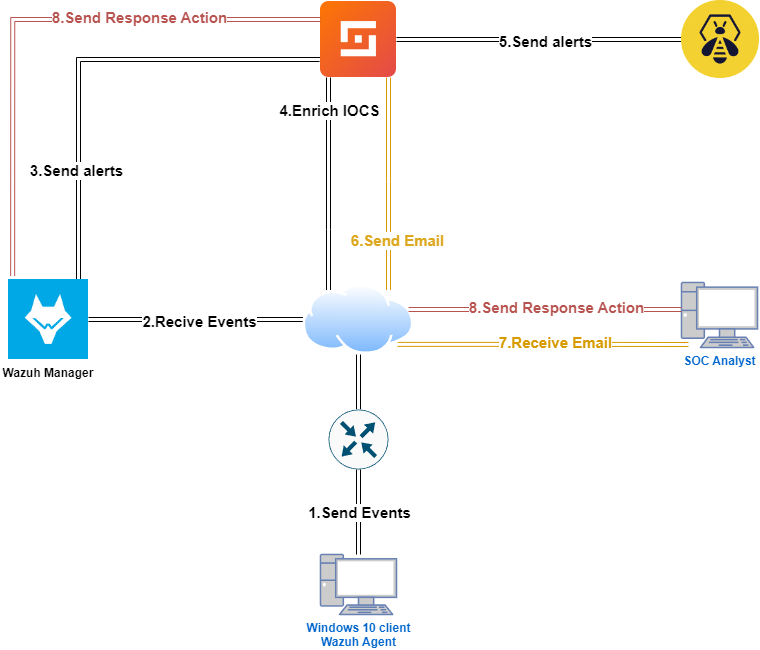

<h1>Security Operations Center (SOC) Automation with Wazuh, SOAR, and Thehive</h1>

This project demonstrates the integration of <strong>Wazuh</strong>, a security monitoring and alerting platform, with a <strong>SOAR (Security Orchestration, Automation, and Response)</strong> system and <strong>VirusTotal</strong> to automate the detection of threats like <em>Mimikatz</em>, enrich alerts, and respond to security incidents.

<h2>Architecture Overview</h2>

<h2>Workflow</h2>
<ol>
  <li><strong>Windows 10 Client (Wazuh Agent)</strong>: Monitors system activity and sends security events, including potential malware uploads like Mimikatz, to the Wazuh Manager.</li>
  
  <li><strong>Wazuh Manager</strong>: Receives events from the agent, processes them, and identifies potential threats. 
    <ul>
      <li>Sends alerts based on suspicious activity (e.g., Mimikatz upload) to the SOAR platform for further automated analysis.</li>
    </ul>
  </li>
  
  <li><strong>SOAR Platform & IOC Enrichment</strong>: Enriches alerts using VirusTotal and automates detection.
    <ul>
      <li>The SOAR system analyzes the uploaded file via <strong>VirusTotal</strong> to detect any known malware signatures and Indicators of Compromise (IOCs).</li>
      <li>Alerts are enriched with contextual data from VirusTotal before further action.</li>
    </ul>
  </li>
  
  <li><strong>Email Notification</strong>: If a threat is detected (e.g., Mimikatz), the SOAR platform sends an automated email alert to the SOC team.
    <ul>
      <li>The email includes detailed information about the threat and any enrichment from VirusTotal.</li>
    </ul>
  </li>
  
  <li><strong>SOC Analyst</strong>: Receives the email alert and can initiate further action, such as mitigating the threat.</li>
  
  <li><strong>Response Action</strong>: Based on the analysis, the SOC Analyst or SOAR platform sends a response action back to the Wazuh Manager to quarantine the system or block malicious activity.</li>
</ol>

<h2>Components</h2>
<ul>
  <li><strong>Wazuh Agent</strong> - Installed on Windows 10 client to monitor events and send them to the Wazuh Manager.</li>
  <li><strong>Wazuh Manager</strong> - Processes the events and sends alerts to the SOAR platform for further analysis.</li>
  <li><strong>SOAR Platform</strong> - Enriches the alerts using VirusTotal and orchestrates automated responses.</li>
  <li><strong>VirusTotal</strong> - Used by the SOAR platform to check for known malicious files (e.g., Mimikatz) and enrich the alerts.</li>
  <li><strong>SOC Analyst</strong> - Receives the alerts via email and can review or initiate further response actions.</li>
</ul>

<h2>Automation Features</h2>
<ul>
  <li>Automated detection of malware uploads like Mimikatz using <strong>Wazuh</strong> and <strong>VirusTotal</strong>.</li>
  <li>Email alerts automatically sent to the SOC Analyst for immediate visibility.</li>
  <li>Response actions automatically sent to the Wazuh Manager for mitigation.</li>
</ul>

<h2>License</h2>

This project is licensed under the MIT License - see the <a href="LICENSE">LICENSE</a> file for details.

